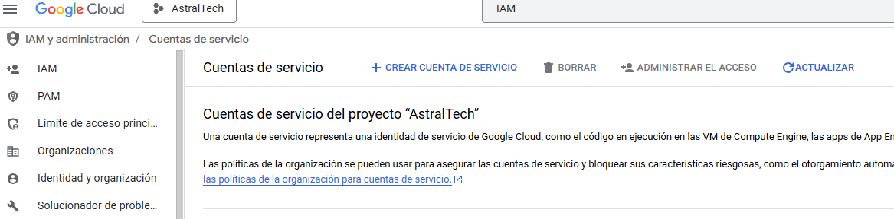
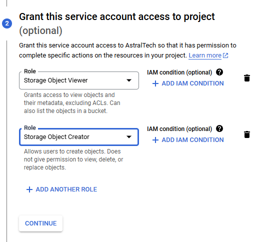
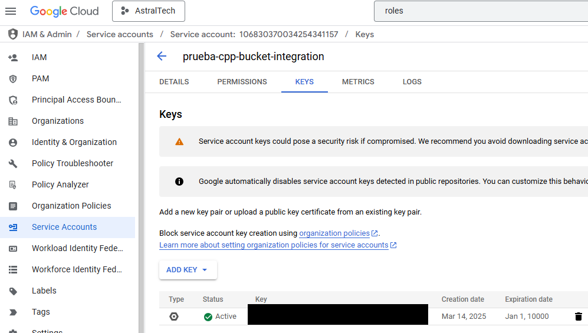

# Sobre este repositorio

El objetivo de este repositorio es ofrecer un conjunto de aplicaciones de ejemplo sobre como utilizar GCP usando C++. Para ello hemos creado 
unos script que ayudan a descargar todo lo necesario para poder usar las librerias de C++de GCP usando el gestor de paquetes de C++ VCPKG.

# Requisitos previos

```
sudo apt update
sudo apt install git cmake curl g++ zip unzip tar
```

# VCPKG

## Introducción

VCPKG es un gestor de paquetes C/C++ gratuito para adquirir y gestionar bibliotecas. Elija entre 2554 bibliotecas de código abierto para descargar y construir en un solo paso o añada sus propias bibliotecas privadas para simplificar su proceso de construcción. Mantenido por el equipo de Microsoft C++ y colaboradores de código abierto.

VCPKG ofrece las siguiente funcionalidades:

- Más de 2300 bibliotecas de código abierto entre las que elegir en un registro mantenido, creado de forma rutinaria para comprobar la compatibilidad de ABI
- Creación de su propio registro de biblioteca personalizada con sus propios paquetes de biblioteca personalizados
- Experiencia coherente y multiplataforma para Windows, macOS y Linux
- Agregar fácilmente bibliotecas al proyecto con cualquier sistema de compilación y proyecto

## Arquitectura interna

Un puerto vcpkg es una **receta de compilación con versiones** que genera un paquete. El tipo de paquete más común es una biblioteca de C/C++ que consta de encabezados, código fuente y archivos binarios.

Un triplete captura el **entorno de compilación** de destino (cpu, os, compilador, tiempo de ejecución, etc.) en un único nombre conveniente. vcpkg proporciona más de 70 triplets de forma predeterminada, pero también puede definir sus propios.

Los manifiestos pueden declarar las dependencias directas y agregar características opcionales o restricciones de versión en un archivo de manifiesto. Los archivos de manifiesto se pueden comprobar en el sistema de control de código fuente y compartirlos con su equipo.

## Instalacion de VPKCG en Linux 

[Seguir el tutorial oficial de Microsoft](https://learn.microsoft.com/es-es/vcpkg/get_started/get-started?pivots=shell-bash) o ejecutar los comandos que aparecen en la caja de código.

```
cd ~
git clone https://github.com/microsoft/vcpkg.git
cd vcpkg && ./bootstrap-vcpkg.sh
export VCPKG_ROOT=/path/to/vcpkg
export PATH=$VCPKG_ROOT:$PATH
```

## Instalacion de VPKCG en Linux (Opcional)

Para crear un proyecto desde cero con VCPKG se tiene que ejecutar el comando 

```
vcpkg new --application
```

Una vez creado el proyecto se pueden importar las librerias incluyendo en el fichero VCPKG.json la referencia a la libreria y version deseado o ejecutando el comando 

```
vcpkg add port <NOMBRE_LIBRERIA>
```

Las librerías disponibles puede verlas [aqui](https://vcpkg.io/en/packages?query=)

# Instalar dependencias no dispoibles en VCPKG

Google Cloud Platform CPP necesita de algunas libreria adicionales que VCPKG no proporciona, son el caso de CRC32 y Opentelemetry

### CRC32

```
mkdir -p $HOME/Downloads/crc32c && cd $HOME/Downloads/crc32c
curl -fsSL https://github.com/google/crc32c/archive/1.1.2.tar.gz | \
    tar -xzf - --strip-components=1 && \
    cmake \
        -DCMAKE_BUILD_TYPE=Release \
        -DBUILD_SHARED_LIBS=yes \
        -DCRC32C_BUILD_TESTS=OFF \
        -DCRC32C_BUILD_BENCHMARKS=OFF \
        -DCRC32C_USE_GLOG=OFF \
        -S . -B cmake-out && \
    cmake --build cmake-out -- -j ${NCPU:-4} && \
sudo cmake --build cmake-out --target install -- -j ${NCPU:-4} && \
sudo ldconfig
```

### Opentelemetry (opcional)

Esta libreria es necesaria si se desea utilizar las funcionaes de opentelemetry

```
mkdir -p $HOME/Downloads/opentelemetry-cpp && cd $HOME/Downloads/opentelemetry-cpp
curl -fsSL https://github.com/open-telemetry/opentelemetry-cpp/archive/v1.19.0.tar.gz | \
    tar -xzf - --strip-components=1 && \
    cmake \
        -DCMAKE_BUILD_TYPE=Release \
        -DBUILD_SHARED_LIBS=yes \
        -DWITH_EXAMPLES=OFF \
        -DWITH_ABSEIL=ON \
        -DBUILD_TESTING=OFF \
        -DOPENTELEMETRY_INSTALL=ON \
        -DOPENTELEMETRY_ABI_VERSION_NO=2 \
        -S . -B cmake-out && \
sudo cmake --build cmake-out --target install -- -j ${NCPU:-4} && \
sudo ldconfig
```

# Google Cloud C++

Google Cloud ha desarrollado librerías C++ para facilitar el uso de los servicio de GCP desde código C++. Todas las libreria están disponibles en el [repositorio de Github de Google](https://github.com/googleapis/google-cloud-cpp)

## Instalación y compilación

```
cd ~
git clone https://github.com/googleapis/google-cloud-cpp.git --depth=1
cd ~/google-cloud-cpp
cmake -S . -B cmake-out -DBUILD_TESTING=OFF -DGOOGLE_CLOUD_CPP_ENABLE_EXAMPLES=OFF -DCMAKE_TOOLCHAIN_FILE=$HOME/vcpkg/scripts/buildsystems/vcpkg.cmake \ -DGOOGLE_CLOUD_CPP_ENABLE=<LIBRERIA_GCO_A_COMPILAR>
cmake --build cmake-out --target install -j ${NCPU:-4}
```

# Uso en aplicacion de ejemplo

## Escribir código de ejemplo

En este código de ejemplo se utiliza la libreria Storage para escribir y leer un objeto en un bucket de GCP Storage.

El proyecto utiliza CMake y VCPKG para descargar y utilizar las librerias con todas las dependecias que necesita Google Cloud CPP.

## Configurar las credenciales de autenticacion con GCP

El cliente necesita las credenciales de autenticación (ADC) para obtener los permisos necesarios e interactuar con los servicios de GCP. Google ofrece diferentes [mecanismos de autenticación](https://cloud.google.com/docs/authentication/set-up-adc-local-dev-environment?hl=es-419) para las librerias cliente, como la federación de identidades o claves de cuentas de servicio.

>[!Warning]
La federación de claves de cuenta de servicio en entornod e producción puedan ocasionar graves problemas de seguridad. Se recomiendan otra alternativas o proteger las claves privadas de forma adecuada.

Los códigos de ejemplo de este repositorioutilizan las claves de cuenta de servicio para autenticarse con GCP. Estas claves las exportamos desde la console de Google en formato JSON y usamos la variable de entorno GOOGLE_APPLICATION_CREDENTIALS=<PATH_CREDENTIAL_FILE_JSON> para indicar a la librería que fichero de credenciales tiene que utlizar.

```
export GOOGLE_APPLICATION_CREDENTIALS=<PATH_CREDENTIAL_FILE_JSON>
```

### Crear cuenta de servicio y descargar clave de cuenta de servicio

En la console de Google ir a IAM > Cuentas de servicio > Crear cuenta de servicio



Asignar los roles necesarios a la cuenta de servicio para crear y leer objetos en un Bucket "Storage Object Creator" y "Storage Object Viewer"



Accede al detalle de la cuenta de servicio, que acabas de crear, y crea una clave de servicio IAM > Cuentas de servicios > <CUENTA_DE_SERVICIO> > Claves



>[!Warning]
El fichero JSON que se descarga al crear la clave debe guardarse de forma segura y tendrás que utilizarlo junto con tu aplicacion C++ para autenticarse en GCP

## Compilar

```
cd gcp-examples
chmod +x build.sh
./build.sh
```

## Ejecutar

```
chmod +x FileMonitor
./FileMonitor <bucket_name>
```
